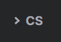

# BlogSite

BlogSite is a placeholder project name for my website [CollinShoop.com](https://www.CollinShoop.com). 

My goals with this project are to

- Have a nice looking link which points to my stuff
- Experiment with unfamiliar tech
- Have the ability to periodically add new content, such as blog posts
- Not spend a lot of time on UI styling

## Why Hugo?

[docs/Hugo](docs/hugo.md)

## Deployment

[docs/Deploy](docs/deploy.md)

## Stuff left to do

[docs/TODO](docs/todo.md)